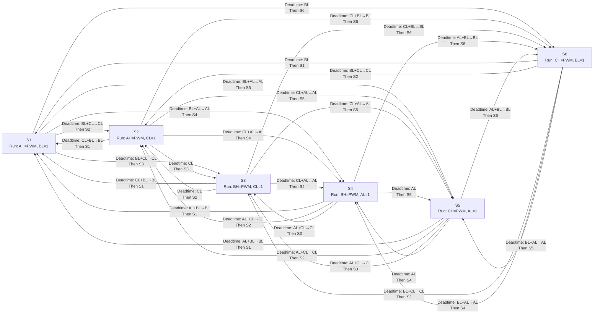

# Commutation Transition Graph

This diagram shows all state-to-state transitions, including the low-side behavior during deadtime.

- All high sides are off during deadtime.
- `X+Y→Y` means old and new low sides overlap for `low_overlap`, then only the new low side remains on until deadtime ends.
- `X` means the low side does not change, so it stays on for the full deadtime.

