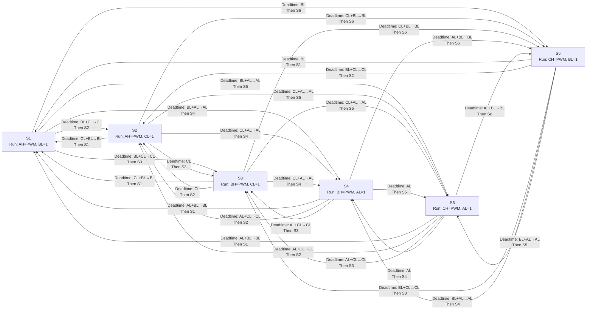
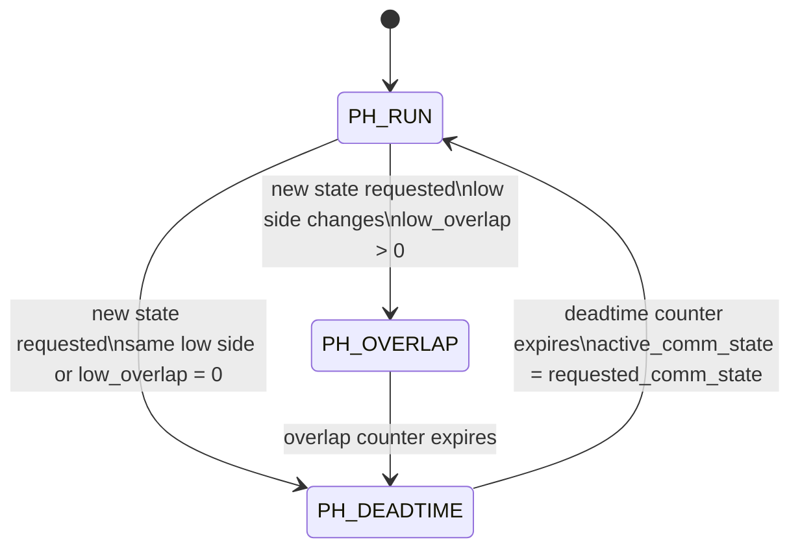

# Commutation Transition Graph

This document shows both:

- the external commutation state-to-state behavior
- the internal transition-phase FSM used to implement overlap and deadtime

- All high sides are off during deadtime.
- `X+Y→Y` means old and new low sides overlap for `low_overlap`, then only the new low side remains on until deadtime ends.
- `X` means the low side does not change, so it stays on for the full deadtime.

## State-To-State Graph

## Internal Phase FSM

This is the structure used in `bldc_motor_core.sv` to realize the transition behavior:

- `PH_RUN`: normal commutation state pattern, including PWM on the active high side
- `PH_OVERLAP`: all high sides off, old and new low sides both on
- `PH_DEADTIME`: all high sides off, only the new low side on

If the low-side leg does not change, the controller skips `PH_OVERLAP` and moves directly from `PH_RUN` to `PH_DEADTIME`.

